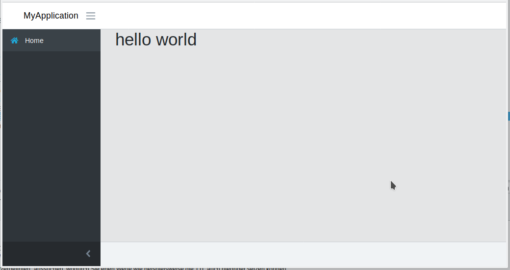

# Phore Status Page - Fastest way to generate a Status page

## Quick start

Your brand new status page can look like this within 30 seconds.


Install library using composer:
```bash
composer require phore/status-page
```

Create your `/www/index.php`:
```php
<?php
namespace App;
use Phore\StatusPage\PageHandler\NaviButtonWithIcon;
use Phore\StatusPage\StatusPageApp;

require __DIR__ . "/../vendor/autoload.php"; // Point to your composer vendor directory here!

$app = new StatusPageApp("MyApplication");

$app->addPage("/", function () {
    return ["h1" => "hello world"];
}, new NaviButtonWithIcon("Home", "fas fa-home"));

$app->serve();
```

***Done!***


## Examples
